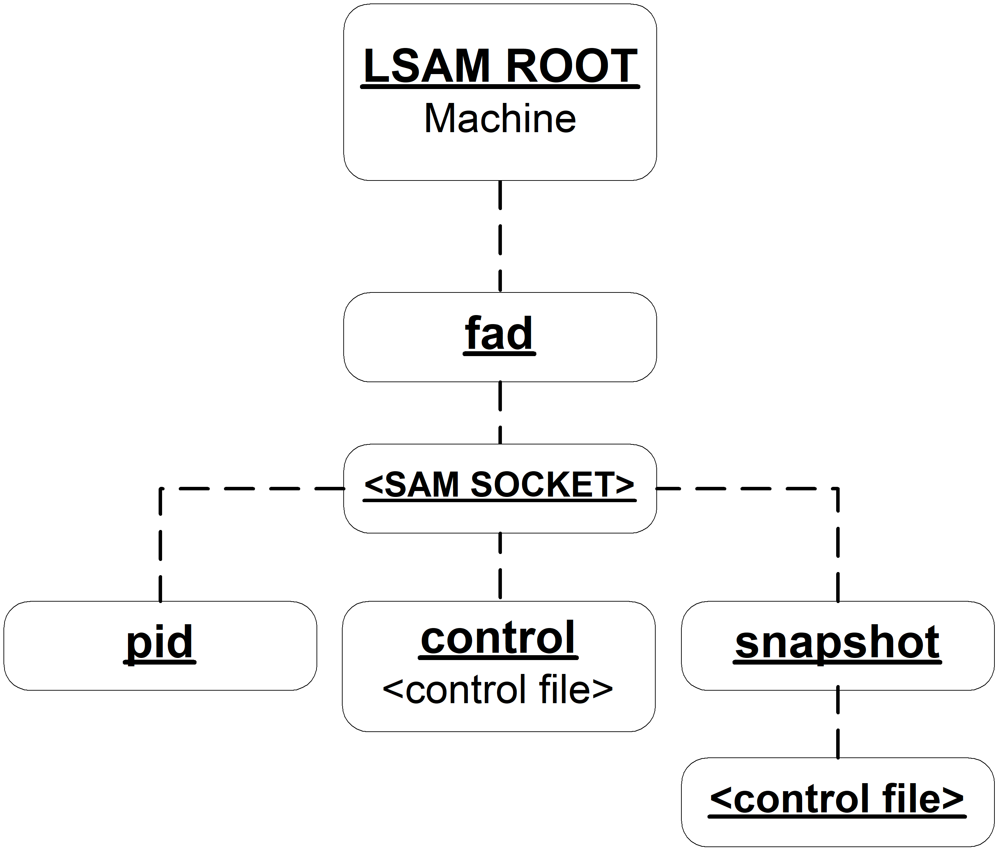

# Directory Structure

The SMA FAD uses the following directory structure to manage file monitoring and event processing.

* The control subdirectory contains one or more Control Files that represent an instance of SMA FAD and act as configuration files.
* The snapshot directory contains tracking information for SMA FAD to manage file monitoring.

:::caution 

Do not remove the files from the snapshot directory; the files are critical for SMA FAD processing.

:::

* When the SMA FAD is running, the pid directory contains one pid for every file in the control directory.

:::caution 

Do not remove the files from the pid directory; the files are critical for SMA FAD processing.

:::