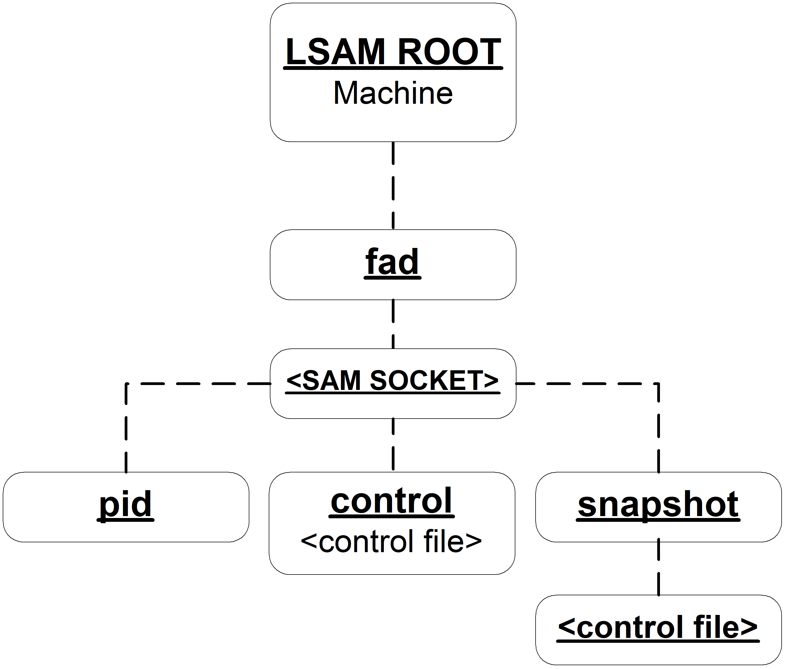

# Directory structure

**Theme:** Configure  
**Who Is It For?** System Administrator

## What is it?

Reference for the SMA FAD directory layout, including the control, snapshot, and pid subdirectories and their roles in file monitoring and event processing.

The SMA FAD uses the following directory structure to manage file monitoring and event processing.

## When would you use it?

- Refer to the directory structure when placing a new Control File — Control Files must reside in the `control` subdirectory for the FAD startup script to detect them and start a corresponding daemon instance.
- Refer to the directory structure when troubleshooting file monitoring behavior — the `snapshot` subdirectory contains tracking information that the SMA FAD uses to determine whether a file has changed between passes.
- Refer to the directory structure when verifying that the SMA FAD is running — the `pid` subdirectory contains one pid file for every file in the control directory while the daemon is active.

## Why would you use it?

- The separation of Control Files, snapshot files, and pid files into dedicated subdirectories lets the daemon manage multiple independent instances cleanly, with each Control File in the `control` subdirectory corresponding to exactly one daemon instance.
- The `snapshot` subdirectory holds the state the SMA FAD needs to detect changes between successive passes; removing files from it causes the daemon to lose its reference point for file monitoring.
- The `pid` subdirectory gives the FAD startup and stop scripts a reliable mechanism for managing daemon instances — one pid file per Control File means the scripts can start or stop each instance independently.

* The control subdirectory contains one or more Control Files that represent an instance of SMA FAD and act as configuration files.
* The snapshot directory contains tracking information for SMA FAD to manage file monitoring.

:::caution 

Do not remove the files from the snapshot directory; they are critical for SMA FAD processing.

:::

* When the SMA FAD is running, the pid directory contains one pid for every file in the control directory.

:::caution 

Do not remove the files from the pid directory; the files are critical for SMA FAD processing.

:::