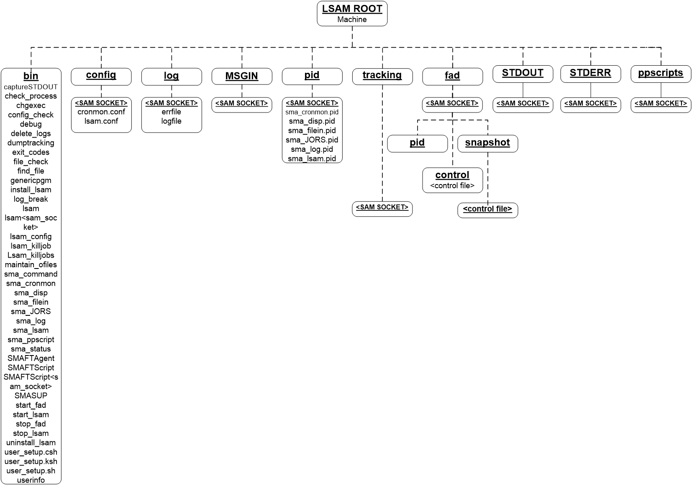

# System impact

**Theme:** Overview  
**Who Is It For?** System Administrator

## What is it?
Reference for directories and files created in the Unix Agent root directory upon initial agent startup.

After the agent has been started, the following directories and files should be in the agent root directory:

- You have started the agent for the first time and need to verify that all expected directories and files were created in the agent root directory.
- You are troubleshooting a startup failure and need to confirm which directories and files should be present after a successful initial run.

- Verifying the expected directories and files after the first startup confirms the agent initialized correctly, giving you confidence that job submission and logging will work before you connect the agent to the SAM.
- Knowing which directories and files the agent creates lets you quickly identify missing or misnamed items during a startup failure, so you can resolve the issue without opening a support case.

:::info Note

The initial run of the agent creates these directories and files.

:::

## Examples

**Scenario:** A system administrator completes a fresh installation of the Unix Agent and starts it for the first time. After running the start command, the administrator uses the system-impact reference to confirm that all expected directories and files are present in the agent root directory. By comparing the actual directory listing against the documented structure, the administrator verifies that the initial run completed successfully and that the agent is ready to communicate with the SAM.
