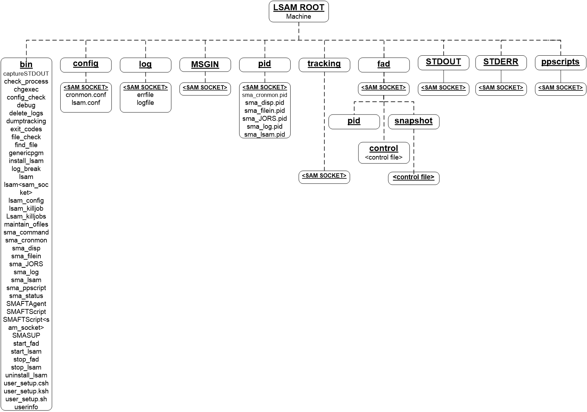

# System impact

**Theme:** Overview  
**Who Is It For?** System Administrator

## What is it?
Reference for directories and files created in the Unix Agent root directory upon initial agent startup.

After the agent has been started, the following directories and files should be in the agent root directory:

- You are troubleshooting a startup failure and need to confirm which directories and files should be present after a successful initial run.
- Knowing which directories and files the agent creates lets you quickly identify missing or misnamed items during a startup failure.

:::info Note

The initial run of the agent creates these directories and files.

:::

## Internal socket files

The agent uses AF_UNIX (local) sockets for internal communication between its daemon processes, including the logging and dispatcher ports (`LSAM_PORT+5` and `LSAM_PORT+6`).

**Agent version 26.0.0 and later (OCAG-764):** Socket files are created in `/run` or `/var/run` when those directories are available. This change reduces inadvertent interference from TLS security scanners that scan `/tmp`.

**Agent versions earlier than 26.0.0:** Socket files are created in `/tmp`.

:::info Note

If your system uses SELinux, AppArmor, or a tmpfs mount policy that restricts write access to `/run` or `/var/run`, verify that the agent process has the necessary permissions to create socket files in those directories. If neither `/run` nor `/var/run` is available, the agent falls back to `/tmp`.

:::

## Examples

**Scenario:** A system administrator completes a fresh installation of the Unix Agent and starts it for the first time. After running the start command, the administrator uses the system-impact reference to confirm that all expected directories and files are present in the agent root directory. By comparing the actual directory listing against the documented structure, the administrator verifies that the initial run completed successfully and that the agent is ready to communicate with the SAM.
